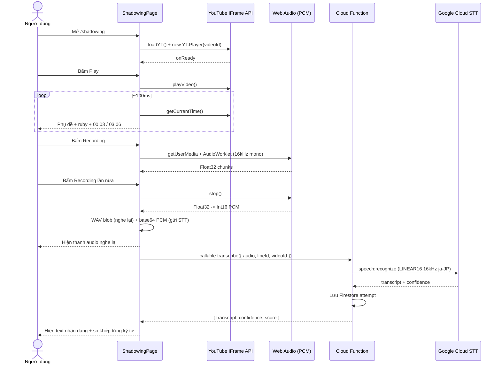
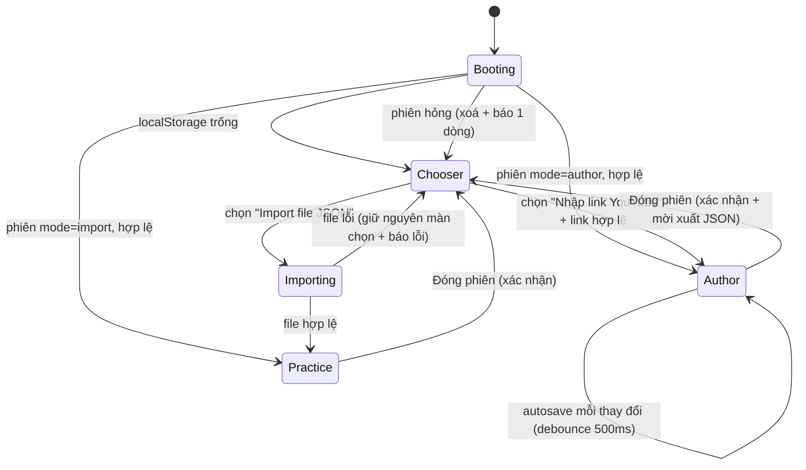

# Tính năng Japanese Shadowing — Phân tích & Thiết kế

> **Trạng thái:** v2 — đã chốt 6 câu hỏi thiết kế · **Phase 1 đã triển khai xong**
> **Người soạn:** Nguyen Hai Nam
> **Ngày:** 2026-10-03
> **Repo:** `nhnam-info-page` (CRA 5 + React 18 + react-router-dom 6 + Bootstrap 5)
> **Firebase project:** `my-page-39b31` (hiện **chỉ có Hosting**)

---

> **Tài liệu này có hai phần.**
> **Phần A** (§0–§16) — tính năng luyện tập, Phase 1 đã triển khai xong.
> **[Phần B](#phần-b--khu-vực-tạo-dữ-liệu-authoring)** (§B1–§B15) — khu vực tự tạo dữ liệu bài học,
> **đã triển khai xong** (trừ phần gọi LLM, cần cấu hình Firebase). Câu hỏi "làm sao sinh
> kana/romaji/nghĩa từ `jp`" được trả lời ở [§B4](#b4-sinh-kana--romaji--vi--tokens-từ-jp).

---

## 0. Trạng thái triển khai

| Phần | Trạng thái | Ghi chú |
|---|---|---|
| Route `/shadowing` + noindex | ✅ Xong | |
| Icon vào trang ở Socialicons | ✅ Xong | `NavLink` + `MdRecordVoiceOver`, có trạng thái active |
| Nhúng + điều khiển YouTube | ✅ Xong & đã kiểm thực tế | duration đọc đúng 02:43 |
| Phụ đề + furigana `<ruby>` | ✅ Xong & đã kiểm thực tế | |
| Tua ±5s, đồng hồ cả video | ✅ Xong & đã kiểm thực tế | `+5`×3 → 00:15, `-5`×2 → 00:05 |
| Ghi âm PCM → WAV 16kHz | ✅ Code xong | **Chưa kiểm được**: headless không có micro |
| Nghe lại bản ghi | ✅ Code xong | như trên |
| Gọi Speech-to-Text | ⚙️ Code xong, **chưa bật** | Cần Blaze + deploy function + `.env.local` |
| Firestore / Storage / rules | ⚙️ File đã có, **chưa deploy** | Phải thay `REPLACE_WITH_YOUR_UID` |
| **Phần B** — màn chọn / phiên localStorage | ✅ Xong & đã kiểm thực tế | |
| **Phần B** — import JSON + bài mẫu | ✅ Xong & đã kiểm thực tế | |
| **Phần B** — soạn bài, nút `+`, chốt end | ✅ Xong & đã kiểm thực tế | `+` tại 00:05 → đóng câu trước, mở câu mới |
| **Phần B** — editor furigana | ✅ Xong & đã kiểm thực tế | kiểm `jp === tokens` trực tiếp |
| **Phần B** — xuất JSON | ✅ Xong | round-trip xuất→nhập có test |
| **Phần B** — tự điền bằng LLM | ⚙️ Code xong, **chưa bật** | Cần Blaze + `ANTHROPIC_API_KEY` + deploy `enrichShadowingLines` |

**Dữ liệu phụ đề hiện tại là MẪU, không khớp nội dung video thật.** Video `ZcKxZfyEFBc`
thực tế là *"(N5 Level) Learn Japanese with Anime for Beginners!"* của kênh LevelupAnime,
không phải bài về 日本の電車. Dùng panel "Công cụ dò mốc" ở chế độ dev để nhập mốc thật
(xem [§12](#12-công-cụ-nhập-liệu-dev-only)).

**Bật Speech-to-Text:** copy `.env.example` → `.env.local` và điền config Firebase; thay
`REPLACE_WITH_YOUR_UID` trong `functions/index.js`, `firestore.rules`, `storage.rules`;
nâng project lên Blaze; bật Cloud Speech-to-Text API; `firebase deploy --only functions,firestore,storage`.
Chưa làm các bước này thì trang vẫn chạy bình thường, chỉ khối nhận dạng hiện dòng hướng dẫn.

---

## 1. TL;DR

Thêm trang `/shadowing` cho phép người học luyện nói tiếng Nhật theo phương pháp *shadowing*:
xem video YouTube → đọc phụ đề có furigana chạy đồng bộ → ghi âm đọc theo →
**đưa bản ghi qua Google Cloud Speech-to-Text để lấy text** → so khớp với câu gốc.

| Hạng mục | Quyết định |
|---|---|
| Route | `/shadowing`, đặt **trước** route `*` trong [Routes.js](../src/app/Routes.js) |
| Video | YouTube IFrame Player API, `videoId` hardcode `ZcKxZfyEFBc` |
| Phụ đề | Tiếng Nhật, **kanji có furigana phía trên** (thẻ `<ruby>`) — [§6.2](#62-furigana-kanji-dùng-ruby) |
| Hai nút mũi tên | **Tua lùi / tới 5 giây** *(chốt Q1)* |
| Đồng hồ | Tiến độ **cả video**: `00:03 / 03:06` *(chốt Q2)* |
| Sau khi ghi âm | **Không có nút tải xuống.** Gửi thẳng qua Google Cloud STT lấy text *(chốt Q3)* |
| Định dạng ghi âm | **WAV / LINEAR16 16 kHz mono** qua Web Audio — *không* dùng MediaRecorder. Lý do ở [§8.2](#82-vì-sao-không-dùng-mediarecorder) |
| SEO | `noindex, nofollow` — link ẩn để tự dùng *(chốt Q5)* |
| Lưu trữ | Firestore + Cloud Storage, schema ở [§7](#7-cấu-trúc-database) |
| Backend | **Cần thêm 1 Cloud Function** làm proxy STT (Blaze plan) |

Ước lượng: **Phase 1 (không STT) ~5 giờ · Phase 2 (STT + DB) ~6 giờ.**

> ⚠️ **Thay đổi lớn so với v1:** quyết định Q3 kéo tính năng từ "thuần client-side" sang
> **cần backend**. Firebase project hiện chỉ bật Hosting — phải thêm Functions + Firestore +
> Storage và **nâng lên gói Blaze** (Spark không cho Cloud Function gọi mạng ra ngoài).

---

## 2. Mục tiêu & phạm vi

### 2.1 Mục tiêu

- **M1** — Mở `/shadowing` xem được video YouTube nhúng trong card tối màu.
- **M2** — Phụ đề tiếng Nhật đổi theo mốc thời gian, **kanji có furigana phía trên**.
- **M3** — Ghi âm giọng đọc theo, bấm lần nữa để dừng.
- **M4** — Nghe lại bản ghi ngay trên trang.
- **M5** — **Lấy được text từ bản ghi qua Google Cloud Speech-to-Text** và so với câu gốc.
- **M6** — Lối vào từ thanh social icon cố định bên trái.

### 2.2 Ngoài phạm vi

- Đăng nhập nhiều người dùng (chỉ 1 chủ sở hữu — trang riêng).
- Quản lý nhiều bài học qua UI admin (nhập liệu trực tiếp vào Firestore).
- Chấm điểm phát âm chuyên sâu (pitch accent, intonation).
- Tải bản ghi về máy *(chốt Q3 — không cần)*.

### 2.3 Ràng buộc đã xác minh trong codebase

| Ràng buộc | Chi tiết |
|---|---|
| Catch-all route | [Routes.js](../src/app/Routes.js) có `<Route path="*" element={<Navigate to="/" replace />} />` → route mới nên khai báo **trước** |
| Page transition | `CSSTransition` + `classNames="page"`, trượt dọc 400ms ([App.css](../src/app/App.css)) → tự có animation |
| Socialicons global | Render trong `AppRoutes`, **ngoài** `TransitionGroup` → hiện ở mọi trang |
| Theme toggle đang tắt | [themetoggle/index.js](../src/components/themetoggle/index.js) hard-code `"light"` + đã comment khỏi header → **card tối phải tự quản màu cục bộ**, không dựa `data-theme` |
| Mobile breakpoint | `991px` — dưới mức này `body` ép `#f5f5f5`, social bar thành hàng ngang (`display: inline`) |
| Body padding | `padding-top: 60px` + border trái/phải 10px |
| Firebase | `firebase@^10.7.1` có trong `package.json` nhưng **chưa dùng ở đâu trong `src/`** → phải khởi tạo từ đầu |
| `firebase.json` | **Chỉ có block `hosting`** → phải thêm `firestore`, `storage`, `functions` |
| CI/CD | `.github/workflows/firebase-hosting-*.yml` chỉ deploy hosting → cần cập nhật nếu muốn auto-deploy functions |

---

## 3. Quyết định thiết kế (đã chốt)

| # | Câu hỏi | Chốt | Ảnh hưởng |
|---|---|---|---|
| Q1 | Hai nút mũi tên cong | **Tua ±5 giây** | `seekTo(t - 5)` / `seekTo(t + 5)`, clamp `[0, duration]`. Bỏ logic prev/next line |
| Q2 | Đồng hồ `00:03 / 00:06` | **Tiến độ cả video** | Lấy `player.getCurrentTime()` / `getDuration()`, không liên quan tới câu |
| Q3 | Nút tải bản ghi | **Không.** Thay bằng **Google Cloud STT** | Thêm Cloud Function + Firestore + Storage; đổi định dạng ghi âm sang WAV |
| Q4 | Nội dung phụ đề | **Chỉ tiếng Nhật, kanji có furigana** | Data model đổi từ `kana` phẳng → mảng `tokens` để render `<ruby>` |
| Q5 | SEO | **Link ẩn tự dùng** | `<meta name="robots" content="noindex, nofollow">`, không vào sitemap |
| Q6 | Ai soạn mốc thời gian | Tôi tạo khung mẫu, bạn điền tiếp | Kèm công cụ dò mốc ở dev mode ([§12](#12-công-cụ-nhập-liệu-dev-only)) |

---

## 4. Luồng sử dụng



### 4.1 Edge case

| # | Tình huống | Xử lý |
|---|---|---|
| E1 | Từ chối quyền mic (`NotAllowedError`) | Banner + hướng dẫn mở lại quyền, nút record disabled |
| E2 | Không có mic (`NotFoundError`) | Banner "Không tìm thấy micro", video vẫn dùng được |
| E3 | Trình duyệt không hỗ trợ Web Audio / `AudioWorklet` | Fallback `ScriptProcessorNode`; nếu vẫn không được thì ẩn khối ghi âm |
| E4 | Chạy trên `http://` không phải localhost | `navigator.mediaDevices` là `undefined` → báo "Cần HTTPS" |
| E5 | Video bị gỡ / chặn nhúng | Bắt `onError` (101/150) → fallback + link YouTube |
| E6 | Autoplay bị chặn | Không autoplay, bắt buộc user bấm Play (user gesture) |
| E7 | Thời gian không nằm trong câu nào (khoảng lặng) | Giữ câu trước ở `opacity: .45` thay vì để trống, tránh "nháy" |
| E8 | Rời trang khi đang ghi âm | Cleanup: `audioContext.close()` + `stream.getTracks().forEach(t => t.stop())` + `URL.revokeObjectURL` |
| E9 | **Ghi âm quá 55s** | Tự dừng. `speech:recognize` đồng bộ **giới hạn 60 giây** — xem [§8.4](#84-giới-hạn-của-speechrecognize) |
| E10 | **STT lỗi / hết quota / mất mạng** | Vẫn giữ bản ghi để nghe lại; hiện nút "Thử nhận dạng lại". Không mất dữ liệu |
| E11 | **STT trả chuỗi rỗng** (im lặng, mic quá nhỏ) | Thông báo "Không nghe rõ — thử nói to hơn", hiện mức âm lượng ghi được |
| E12 | Tua ±5s vượt biên | Clamp `Math.min(Math.max(t ± 5, 0), duration)` |

---

## 5. Mockup giao diện

### 5.1 Desktop — IDLE

```text
  Shadowing 日本語

  +--------------------------------------------------------------+
  |                                                          [⧉] |  <- copy phụ đề
  |                                                              |
  |    + - - - - - - - - - - - - - - - - - - - - - - +           |
  |    :                                             :           |
  |    :                   VIDEO                     :           |  <- iframe 16:9
  |    :                                             :           |
  |    + - - - - - - - - - - - - - - - - - - - - - - +           |
  |                                                              |
  |        にほん     でんしゃ                                     |  <- furigana (rt)
  |        日本 の 電車 は                                        |  <- câu (28px)
  |                                                              |
  |    ------------------------------------------                |  <- divider
  |                                                              |
  |    (sound) ON        (mic) Recording                         |
  |                                                              |
  |                 00:03 / 03:06                                |  <- tiến độ CẢ VIDEO
  |                                                              |
  |            [ -5 ]    [ > ]     [ +5 ]                        |
  |            lùi 5s    play      tới 5s                        |
  +--------------------------------------------------------------+
```

### 5.2 RECORDING

```text
  |    (sound) OFF       (o) Recording  00:04     <- đỏ + pulse   |
  |                 00:12 / 03:06                                |
  |            [ -5 ]    [ || ]    [ +5 ]                        |
  |    ▁▃▅▇▅▃▁▃▅▇█▇▅▃▁▂▄▆▄▂▁▃▅▃▁                                 |  <- level mic
```

### 5.3 TRANSCRIBING → RESULT (thay cho nút tải xuống)

```text
  +--------------------------------------------------------------+
  |    ------------------------------------------                |
  |                                                              |
  |    Bản ghi của bạn                                           |
  |    +----------------------------------------------+          |
  |    |  >  --o--------------------   0:02 / 0:05    |          |
  |    +----------------------------------------------+          |
  |                                                              |
  |    (o o o) Đang nhận dạng...                  <- spinner     |
  |                                                              |
  |    --- sau khi STT trả về ---                                |
  |                                                              |
  |    Bạn đã đọc                              94%  độ khớp      |
  |    日本の電車は                                               |
  |    ^^^^^^^^^^^  xanh = khớp / đỏ = sai / gạch = thiếu        |
  |                                                              |
  |    Câu gốc:  日本の電車は                                     |
  |                                                              |
  |    [ Thu lại ]   [ Nhận dạng lại ]                           |
  +--------------------------------------------------------------+
```

### 5.4 Lỗi quyền mic

```text
  |    +------------------------------------------------+        |
  |    | !  Trình duyệt đang chặn micro.                 |        |
  |    |    Bấm icon khoá trên thanh địa chỉ -> cho phép |        |
  |    |    Microphone -> tải lại trang.     [ Thử lại ] |        |
  |    +------------------------------------------------+        |
```

### 5.5 Mobile (< 768px)

```text
 +------------------------+
 | Shadowing 日本語   [⧉] |
 | +--------------------+ |
 | |       VIDEO        | |   16:9 full width
 | +--------------------+ |
 |    にほん   でんしゃ    |
 |    日本 の 電車 は      |   22px, căn giữa
 | ---------------------- |
 |  ON          Record    |   vùng chạm 44px
 |     00:03 / 03:06      |
 |   [-5]   [ > ]   [+5]  |   nút 48px
 +------------------------+
```

### 5.6 Giải nghĩa control

| Control | Hành vi |
|---|---|
| Copy `⧉` | Copy câu phụ đề hiện tại (text thuần, không kèm furigana) vào clipboard, toast 1.5s |
| `ON` / `OFF` | `player.mute()` / `unMute()`. **Nên tắt khi thu** để tiếng video không lọt vào mic |
| Record | Toggle. Idle → đỏ + pulse + đếm giờ. Bấm lại → dừng, hiện player + tự gọi STT |
| `00:03 / 03:06` | **Tiến độ cả video** — `getCurrentTime()` / `getDuration()` |
| `[ -5 ]` | `seekTo(clamp(t - 5))` |
| `[ > ]` / `[ || ]` | `playVideo()` / `pauseVideo()` |
| `[ +5 ]` | `seekTo(clamp(t + 5))` |

### 5.7 Design tokens

```css
.shadowing {
  --sd-card-bg:      #141414;
  --sd-card-border:  #262626;
  --sd-surface:      #1c1c1c;
  --sd-text:         #f2f2f2;
  --sd-text-dim:     #8a8a8a;
  --sd-accent:       #cc0000;   /* trùng --text-color-3 của site */
  --sd-rec:          #ff3b30;
  --sd-ok:           #4ade80;   /* ký tự khớp */
  --sd-bad:          #ff6b6b;   /* ký tự sai */
  --sd-radius:       16px;
}
```

---

## 6. Mô hình dữ liệu phía client

### 6.1 Nguyên tắc: file tĩnh dùng **đúng** shape của Firestore

`src/data/shadowing.js` khai báo y hệt document Firestore ở [§7](#7-cấu-trúc-database).
Khi chuyển sang DB thật chỉ cần đổi 1 hàm, component không phải sửa gì:

```js
// src/data/shadowingRepo.js
export async function getVideo(videoId) {
  if (USE_FIRESTORE) {
    const snap = await getDoc(doc(db, "shadowing_videos", videoId));
    return snap.exists() ? snap.data() : null;
  }
  return localVideos.find((v) => v.videoId === videoId) ?? null;
}
```

### 6.2 Furigana: kanji dùng `<ruby>`

Quyết định Q4 làm data model đổi — không thể dùng một chuỗi `kana` phẳng cho cả câu,
vì furigana phải nằm **đúng trên từng cụm kanji**. Giải pháp: tách câu thành `tokens`.

```js
{
  jp: "日本の電車は",                 // text thuần — dùng để so khớp STT và copy
  tokens: [
    { t: "日本", r: "にほん" },        // t = text, r = ruby (chỉ có khi là kanji)
    { t: "の" },
    { t: "電車", r: "でんしゃ" },
    { t: "は" }
  ]
}
```

Render:

```jsx
<p className="sd-jp" lang="ja">
  {line.tokens?.length
    ? line.tokens.map((tk, i) =>
        tk.r
          ? <ruby key={i}>{tk.t}<rt>{tk.r}</rt></ruby>
          : <span key={i}>{tk.t}</span>
      )
    : line.jp /* fallback khi chưa gắn tokens */}
</p>
```

```css
.sd-jp {
  line-height: 2.1;                 /* BẮT BUỘC — thiếu là rt bị cắt mất trên */
  font-family: "Noto Sans JP", "Hiragino Kaku Gothic ProN", "Yu Gothic", Meiryo, sans-serif;
  font-size: clamp(20px, 2.4vw, 30px);
}
.sd-jp ruby    { ruby-position: over; -webkit-ruby-position: before; }  /* Safari cần prefix */
.sd-jp rt      { font-size: .45em; font-weight: 400; color: var(--sd-text-dim); user-select: none; }
```

> **Sinh `tokens` tự động:** viết tay rất mệt. Có thể dùng `kuroshiro` + `kuromoji` để tách từ và
> gắn furigana, nhưng **chạy ở script build offline rồi ghi vào data**, *không* nhúng runtime —
> từ điển kuromoji nặng vài MB, nhét vào bundle là hỏng hiệu năng trang.
> Dù vậy vẫn phải rà tay: kuromoji đọc sai tên riêng và từ đa âm (例: 入る / 行く) khá thường.

---

## 7. Cấu trúc Database

Dùng **Cloud Firestore** (document) + **Cloud Storage** (file audio).
Firebase project sẵn có: `my-page-39b31`.

### 7.1 Tổng quan collection

```text
firestore/
├── shadowing_videos/{videoId}              1 doc = 1 video + toàn bộ câu (nhúng mảng)
├── shadowing_attempts/{attemptId}          1 doc = 1 lần thu + kết quả STT
└── shadowing_stats/{videoId}               (tuỳ chọn) tổng hợp số liệu luyện tập

storage/
└── shadowing/{videoId}/{lineId}/{timestamp}.wav
```

**Vì sao nhúng `lines` vào chính doc video, không tách subcollection?**

| | Nhúng mảng | Subcollection |
|---|---|---|
| Số request để render trang | **1** | 1 + N |
| Giới hạn | 1 MB/doc → ~**2.000–3.000 câu** tiếng Nhật | Không giới hạn |
| Sửa 1 câu | Ghi lại cả doc | Ghi 1 doc nhỏ |
| Query riêng từng câu | Không | Có |

→ Video shadowing thực tế 50–300 câu, **nhúng là đúng**. Nếu sau này có video > 1.000 câu
thì tách `shadowing_videos/{videoId}/lines/{lineId}`; `schemaVersion` đã có sẵn để migrate.

### 7.2 `shadowing_videos/{videoId}` — ví dụ đầy đủ cho 1 video

Document ID = chính `videoId` của YouTube (`ZcKxZfyEFBc`) → tra cứu O(1), không cần query.

```json
{
  "schemaVersion": 1,

  "videoId": "ZcKxZfyEFBc",
  "provider": "youtube",
  "url": "https://www.youtube.com/watch?v=ZcKxZfyEFBc",
  "thumbnail": "https://i.ytimg.com/vi/ZcKxZfyEFBc/hqdefault.jpg",
  "durationSec": 186,

  "title": "日本の電車",
  "titleVi": "Tàu điện ở Nhật",
  "level": "N4",
  "tags": ["daily-life", "transport"],
  "sourceChannel": "",

  "lineCount": 3,
  "lines": [
    {
      "id": 1,
      "start": 0,
      "end": 6,
      "jp": "日本の電車は",
      "kana": "にほんのでんしゃは",
      "romaji": "nihon no densha wa",
      "vi": "Tàu điện ở Nhật thì…",
      "tokens": [
        { "t": "日本", "r": "にほん" },
        { "t": "の" },
        { "t": "電車", "r": "でんしゃ" },
        { "t": "は" }
      ],
      "note": ""
    },
    {
      "id": 2,
      "start": 6,
      "end": 11.5,
      "jp": "とても時間に正確です。",
      "kana": "とてもじかんにせいかくです",
      "romaji": "totemo jikan ni seikaku desu",
      "vi": "rất đúng giờ.",
      "tokens": [
        { "t": "とても" },
        { "t": "時間", "r": "じかん" },
        { "t": "に" },
        { "t": "正確", "r": "せいかく" },
        { "t": "です。" }
      ],
      "note": "正確（せいかく）= chính xác, đúng"
    },
    {
      "id": 3,
      "start": 11.5,
      "end": 17.2,
      "jp": "一分でも遅れると、お詫びの放送が流れます。",
      "kana": "いっぷんでもおくれると、おわびのほうそうがながれます",
      "romaji": "ippun demo okureru to, owabi no housou ga nagaremasu",
      "vi": "Chỉ cần trễ một phút là có thông báo xin lỗi phát ra.",
      "tokens": [
        { "t": "一分", "r": "いっぷん" },
        { "t": "でも" },
        { "t": "遅", "r": "おく" },
        { "t": "れると、" },
        { "t": "お" },
        { "t": "詫", "r": "わ" },
        { "t": "びの" },
        { "t": "放送", "r": "ほうそう" },
        { "t": "が" },
        { "t": "流", "r": "なが" },
        { "t": "れます。" }
      ],
      "note": "Chú ý okurigana: 遅れる chỉ furigana cho 遅"
    }
  ],

  "visibility": "private",
  "ownerUid": "<uid cua ban>",
  "createdAt": "<Timestamp>",
  "updatedAt": "<Timestamp>"
}
```

**Giải thích các trường quan trọng**

| Trường | Kiểu | Ghi chú |
|---|---|---|
| `schemaVersion` | number | Bắt buộc có từ ngày đầu. Đổi cấu trúc sau này không phải đoán doc nào theo format nào |
| `videoId` | string(11) | Trùng document ID — lặp lại để query `where` được khi cần |
| `durationSec` | number | Cache lại để không phải chờ player ready mới vẽ được thanh tiến độ |
| `lineCount` | number | Denormalize — tránh phải tải cả `lines` chỉ để đếm ở màn danh sách |
| `lines[].id` | number | **Ổn định, không bao giờ đánh lại số.** `shadowing_attempts` tham chiếu tới nó |
| `lines[].start/end` | number (giây, hỗ trợ thập phân) | Bất biến: `end > start`, không chồng lấn, sắp tăng dần |
| `lines[].jp` | string | **Nguồn chân lý để so khớp với STT.** `tokens` chỉ phục vụ hiển thị |
| `lines[].tokens` | array | `{t, r?}` — `r` chỉ có khi `t` là kanji. Xem [§6.2](#62-furigana-kanji-dùng-ruby) |
| `lines[].note` | string | Ghi chú ngữ pháp/từ vựng, hiện khi hover (phase 3) |
| `ownerUid` | string | Khoá security rules. Trang riêng → chỉ 1 uid |

> ⚠️ **Bất biến phải giữ:** `jp` **luôn** bằng `tokens.map(t => t.t).join("")`.
> Sửa một bên mà quên bên kia là so khớp STT sai ngay. Nên viết `assertLineConsistent()`
> chạy ở dev — xem [§12](#12-công-cụ-nhập-liệu-dev-only).

### 7.3 `shadowing_attempts/{attemptId}` — 1 lần thu

Document ID tự sinh. Đây là nơi chứa kết quả Speech-to-Text.

```json
{
  "schemaVersion": 1,

  "ownerUid": "<uid cua ban>",
  "videoId": "ZcKxZfyEFBc",
  "lineId": 1,

  "audio": {
    "storagePath": "shadowing/ZcKxZfyEFBc/1/1759449600000.wav",
    "mimeType": "audio/wav",
    "encoding": "LINEAR16",
    "sampleRateHertz": 16000,
    "channels": 1,
    "durationMs": 5120,
    "bytes": 163840
  },

  "stt": {
    "provider": "google-stt-v1",
    "model": "latest_short",
    "languageCode": "ja-JP",
    "transcript": "日本の電車は",
    "confidence": 0.94,
    "alternatives": [],
    "latencyMs": 820,
    "requestedAt": "<Timestamp>"
  },

  "score": {
    "refNormalized": "日本の電車は",
    "hypNormalized": "日本の電車は",
    "distance": 0,
    "accuracy": 1.0,
    "diff": [
      { "op": "equal", "text": "日本の電車は" }
    ]
  },

  "videoTimeAtStart": 2.4,
  "createdAt": "<Timestamp>"
}
```

**Trường `score.diff`** — mảng op dùng để tô màu từng ký tự ở UI ([§5.3](#53-transcribing--result-thay-cho-nút-tải-xuống)):

```json
"diff": [
  { "op": "equal",  "text": "日本の" },
  { "op": "replace", "text": "電卓", "expected": "電車" },
  { "op": "delete",  "text": "は" }
]
```

| `op` | Nghĩa | Màu |
|---|---|---|
| `equal` | Đọc đúng | `--sd-ok` |
| `replace` | Đọc sai thành chữ khác | `--sd-bad` |
| `insert` | Thừa so với câu gốc | `--sd-bad` gạch ngang |
| `delete` | Thiếu, chưa đọc | `--sd-text-dim` gạch chân |

### 7.4 Index cần tạo

Firestore tự index field đơn. Chỉ cần **1 composite index** cho màn lịch sử luyện tập:

```text
Collection: shadowing_attempts
Fields:     ownerUid (ASC), videoId (ASC), createdAt (DESC)
```

Khai báo trong `firestore.indexes.json`:

```json
{
  "indexes": [
    {
      "collectionGroup": "shadowing_attempts",
      "queryScope": "COLLECTION",
      "fields": [
        { "fieldPath": "ownerUid", "order": "ASCENDING" },
        { "fieldPath": "videoId",  "order": "ASCENDING" },
        { "fieldPath": "createdAt", "order": "DESCENDING" }
      ]
    }
  ],
  "fieldOverrides": []
}
```

### 7.5 Security rules

Trang riêng → **khoá chặt theo `ownerUid`**, client chỉ được đọc:

```javascript
// firestore.rules
rules_version = '2';
service cloud.firestore {
  match /databases/{database}/documents {

    function isOwner() {
      return request.auth != null
          && request.auth.uid == 'UID_CUA_BAN';   // hard-code: trang 1 người dùng
    }

    match /shadowing_videos/{videoId} {
      allow read:  if isOwner();
      allow write: if false;        // nhập liệu qua Firebase Console / script admin
    }

    match /shadowing_attempts/{attemptId} {
      allow read:   if isOwner() && resource.data.ownerUid == request.auth.uid;
      allow create: if false;       // CHỈ Cloud Function (Admin SDK) được ghi
      allow update, delete: if false;
    }
  }
}
```

```javascript
// storage.rules
rules_version = '2';
service firebase.storage {
  match /b/{bucket}/o {
    match /shadowing/{videoId}/{lineId}/{file} {
      allow read:  if request.auth != null && request.auth.uid == 'UID_CUA_BAN';
      allow write: if request.auth != null
                   && request.auth.uid == 'UID_CUA_BAN'
                   && request.resource.size < 5 * 1024 * 1024
                   && request.resource.contentType == 'audio/wav';
    }
  }
}
```

> **Vì sao `attempts` chỉ cho Cloud Function ghi?** Nếu client ghi trực tiếp thì `score` và
> `confidence` do client tự khai — dữ liệu luyện tập mất hết ý nghĩa. Function đã gọi STT rồi
> thì ghi luôn bằng Admin SDK, client chỉ đọc.

### 7.6 `firebase.json` sau khi bổ sung

Hiện tại file **chỉ có block `hosting`**. Cần thành:

```json
{
  "hosting": {
    "public": "build",
    "ignore": ["firebase.json", "**/.*", "**/node_modules/**"],
    "rewrites": [{ "source": "**", "destination": "/index.html" }]
  },
  "firestore": {
    "rules": "firestore.rules",
    "indexes": "firestore.indexes.json"
  },
  "storage": {
    "rules": "storage.rules"
  },
  "functions": {
    "source": "functions",
    "runtime": "nodejs20"
  }
}
```

### 7.7 Phương án thay thế nếu không dùng Firestore (SQL)

```sql
CREATE TABLE shadowing_video (
  video_id      VARCHAR(16)  PRIMARY KEY,         -- 'ZcKxZfyEFBc'
  provider      VARCHAR(16)  NOT NULL DEFAULT 'youtube',
  url           TEXT         NOT NULL,
  title         VARCHAR(255) NOT NULL,
  title_vi      VARCHAR(255),
  level         CHAR(2),                          -- N5..N1
  duration_sec  INT,
  thumbnail     TEXT,
  owner_uid     VARCHAR(64)  NOT NULL,
  created_at    TIMESTAMP    NOT NULL DEFAULT CURRENT_TIMESTAMP,
  updated_at    TIMESTAMP    NOT NULL DEFAULT CURRENT_TIMESTAMP
);

CREATE TABLE shadowing_line (
  id         BIGSERIAL    PRIMARY KEY,
  video_id   VARCHAR(16)  NOT NULL REFERENCES shadowing_video(video_id) ON DELETE CASCADE,
  line_no    INT          NOT NULL,               -- ổn định, không đánh lại
  start_sec  NUMERIC(8,3) NOT NULL,
  end_sec    NUMERIC(8,3) NOT NULL,
  jp         TEXT         NOT NULL,
  kana       TEXT,
  romaji     TEXT,
  vi         TEXT,
  tokens     JSONB        NOT NULL DEFAULT '[]',  -- [{t,r?}, ...]
  note       TEXT,
  CONSTRAINT line_range CHECK (end_sec > start_sec),
  UNIQUE (video_id, line_no)
);
CREATE INDEX idx_line_video_start ON shadowing_line (video_id, start_sec);

CREATE TABLE shadowing_attempt (
  id             BIGSERIAL    PRIMARY KEY,
  owner_uid      VARCHAR(64)  NOT NULL,
  video_id       VARCHAR(16)  NOT NULL REFERENCES shadowing_video(video_id) ON DELETE CASCADE,
  line_no        INT          NOT NULL,
  audio_path     TEXT         NOT NULL,
  duration_ms    INT,
  sample_rate    INT          NOT NULL DEFAULT 16000,
  stt_provider   VARCHAR(32)  NOT NULL DEFAULT 'google-stt-v1',
  transcript     TEXT,
  confidence     NUMERIC(4,3),
  accuracy       NUMERIC(4,3),
  edit_distance  INT,
  diff           JSONB,
  created_at     TIMESTAMP    NOT NULL DEFAULT CURRENT_TIMESTAMP,
  FOREIGN KEY (video_id, line_no) REFERENCES shadowing_line(video_id, line_no)
);
CREATE INDEX idx_attempt_owner_video ON shadowing_attempt (owner_uid, video_id, created_at DESC);
```

---

## 8. Ghi âm & Speech-to-Text

### 8.1 Kiến trúc

```text
Browser                          Firebase                      Google Cloud
-------                          --------                      ------------
getUserMedia
  -> AudioContext(16kHz)
  -> AudioWorklet (Float32)
  -> Int16 PCM
       |
       +--> WAV blob  --------------------------------------> <audio> nghe lại (local)
       |
       +--> base64 PCM --> httpsCallable('transcribeShadowing')
                              |
                              +-> Cloud Function (service account)
                                    |-> speech:recognize ----> Speech-to-Text API
                                    |<- transcript, confidence
                                    |-> tính diff + accuracy
                                    |-> ghi shadowing_attempts (Admin SDK)
                              <-----+
                           { transcript, confidence, score }
```

### 8.2 Vì sao **không** dùng MediaRecorder

Đây là thay đổi quan trọng nhất so với v1, lý do thuần kỹ thuật:

| Trình duyệt | MediaRecorder xuất ra | Google STT có nhận? |
|---|---|---|
| Chrome / Edge / Firefox | `audio/webm;codecs=opus` | Có (`WEBM_OPUS`) |
| **Safari (macOS + iOS)** | **`audio/mp4` (AAC)** | **KHÔNG** — STT không hỗ trợ AAC/MP4 |

Google Speech-to-Text nhận: `LINEAR16`, `FLAC`, `MULAW`, `AMR`, `AMR_WB`, `OGG_OPUS`,
`SPEEX_WITH_HEADER_BYTE`, `WEBM_OPUS`, `MP3`. Không có AAC.

→ Nếu dùng MediaRecorder sẽ phải **viết 2 nhánh code** và Safari vẫn hỏng.
Thu PCM thẳng bằng Web Audio rồi tự đóng gói WAV giải quyết cả hai: chạy mọi trình duyệt,
và `LINEAR16 16 kHz mono` đúng **chính xác** định dạng Google khuyến nghị cho STT.

```js
// Trình duyệt tự resample — không phải tự viết hàm downsample
const ctx = new AudioContext({ sampleRate: 16000 });
const source = ctx.createMediaStreamSource(stream);
await ctx.audioWorklet.addModule("/pcm-worklet.js");   // đặt ở public/
const node = new AudioWorkletNode(ctx, "pcm-recorder");
node.port.onmessage = (e) => chunks.push(e.data);      // Float32Array
source.connect(node);
```

> `AudioWorklet` cần file module **tải qua HTTP** — trong CRA phải đặt ở `public/pcm-worklet.js`
> (không phải `src/`, vì webpack sẽ bundle mất). Fallback `ScriptProcessorNode` cho trình duyệt cũ:
> đã deprecated nhưng vẫn chạy ở mọi nơi.

Float32 → Int16:

```js
function toInt16(float32) {
  const out = new Int16Array(float32.length);
  for (let i = 0; i < float32.length; i++) {
    const s = Math.max(-1, Math.min(1, float32[i]));
    out[i] = s < 0 ? s * 0x8000 : s * 0x7fff;
  }
  return out;
}
```

### 8.3 Cloud Function proxy

```js
// functions/index.js
const { onCall, HttpsError } = require("firebase-functions/v2/https");
const { SpeechClient } = require("@google-cloud/speech");
const admin = require("firebase-admin");

admin.initializeApp();
const speech = new SpeechClient();
const OWNER_UID = "UID_CUA_BAN";

exports.transcribeShadowing = onCall(
  { region: "asia-southeast1", memory: "512MiB", timeoutSeconds: 60 },
  async (req) => {
    if (req.auth?.uid !== OWNER_UID) throw new HttpsError("permission-denied", "Not allowed");

    const { audioBase64, videoId, lineId } = req.data;
    if (!audioBase64) throw new HttpsError("invalid-argument", "Missing audio");

    const [res] = await speech.recognize({
      config: {
        encoding: "LINEAR16",
        sampleRateHertz: 16000,
        audioChannelCount: 1,
        languageCode: "ja-JP",
        model: "latest_short",            // tối ưu cho câu ngắn
        enableAutomaticPunctuation: false, // dấu câu tự thêm làm lệch so khớp
        maxAlternatives: 1,
      },
      audio: { content: audioBase64 },
    });

    const alt = res.results?.[0]?.alternatives?.[0];
    const transcript = alt?.transcript?.trim() ?? "";
    // ... tính diff với line.jp, ghi shadowing_attempts, trả về client
    return { transcript, confidence: alt?.confidence ?? 0 };
  }
);
```

**Vì sao proxy mà không gọi STT thẳng từ browser?** Gọi thẳng buộc phải nhúng API key vào
bundle JS — ai mở DevTools cũng lấy được và dùng tiêu tiền trên project của bạn. Hạn chế theo
HTTP referrer có thể giả mạo bằng `curl`. Function giữ credential ở server, và tiện thể ghi
luôn `shadowing_attempts` bằng Admin SDK.

> **Cần gói Blaze.** Spark (free) **không cho Cloud Function gọi mạng ra ngoài** kể cả tới API
> của chính Google. Chi phí thực tế cho mức dùng cá nhân gần như bằng 0, nhưng **bắt buộc gắn thẻ**.
> Nhớ đặt **budget alert** để yên tâm.

### 8.4 Giới hạn của `speech:recognize`

| Giới hạn | Giá trị | Ảnh hưởng |
|---|---|---|
| Độ dài audio (đồng bộ) | **60 giây** | Shadowing 1 câu ~5–15s → thoải mái. **Tự dừng ghi ở 55s** (E9) |
| Kích thước request inline | **10 MB** | WAV 16kHz mono = 32 KB/s → 55s ≈ 1.7 MB. An toàn |
| Dài hơn 60s | Phải dùng `longRunningRecognize` + file trên GCS | Ngoài phạm vi |

Chi phí STT tính theo phút audio, có hạn mức miễn phí hằng tháng.
Mức dùng cá nhân (vài chục câu/ngày, mỗi câu ~10s) nằm trong hoặc sát hạn mức free —
nhưng **giá và hạn mức thay đổi theo thời gian, hãy xem trang pricing của Google Cloud trước khi bật**.

### 8.5 So khớp transcript với câu gốc

```js
// Chuẩn hoá trước khi so — nếu không sẽ sai oan vì dấu câu
const normalize = (s) =>
  s.replace(/[\s　]/g, "")        // bỏ khoảng trắng kể cả full-width
   .replace(/[、。！？「」・,.!?]/g, "") // bỏ dấu câu JP + Latin
   .normalize("NFKC");                // thống nhất full-width / half-width

// Levenshtein trên ký tự -> accuracy + mảng diff để tô màu
const accuracy = 1 - distance / Math.max(refNorm.length, 1);
```

> ⚠️ **Hạn chế thật sự cần biết:** STT trả về **kanji**, và cách Google chọn kanji có thể khác
> cách viết trong `jp` dù **phát âm hoàn toàn đúng** (ví dụ 下さい ↔ ください, 時 ↔ とき).
> Điểm `accuracy` vì vậy là **tham khảo**, không phải thước đo phát âm.
> Luôn hiện transcript thô bên cạnh câu gốc để tự đối chiếu bằng mắt.
> Muốn chính xác hơn thì phải chuyển cả hai về kana rồi mới so — cần thư viện phân tích hình thái
> (kuromoji), cân nhắc ở phase 3.

---

## 9. Kiến trúc & cấu trúc file

```text
AppRoutes (src/app/Routes.js)
├── AnimatedRoutes
│   └── Route "/shadowing"
│       └── Shadowing                   src/pages/shadowing/index.js
│           ├── <Helmet>                noindex, nofollow  (Q5)
│           └── ShadowingCard
│               ├── CopyButton
│               ├── YouTubeStage        components/shadowing/YouTubeStage.js
│               ├── SubtitleTrack       components/shadowing/SubtitleTrack.js   <- <ruby>
│               ├── ControlBar          components/shadowing/ControlBar.js
│               │   ├── AudioToggle
│               │   ├── RecordButton
│               │   ├── TimeDisplay     <- tiến độ CẢ VIDEO (Q2)
│               │   └── TransportButtons <- -5s / play / +5s (Q1)
│               ├── RecordingPlayback   components/shadowing/RecordingPlayback.js
│               ├── TranscriptResult    components/shadowing/TranscriptResult.js <- MỚI
│               └── PermissionBanner
└── Socialicons  <- thêm <li> trỏ /shadowing
```

| Loại | Đường dẫn | Mô tả |
|---|---|---|
| THÊM | `src/pages/shadowing/{index.js,style.css}` | Trang + style |
| THÊM | `src/components/shadowing/*.js` | 6 component con ở trên |
| THÊM | `src/hooks/useYouTubePlayer.js` | Nạp IFrame API, player, poll time |
| THÊM | `src/hooks/usePcmRecorder.js` | Web Audio PCM → WAV + base64 |
| THÊM | `src/hooks/useActiveLine.js` | `currentTime` → câu active |
| THÊM | `src/hooks/useTranscribe.js` | Gọi callable function, giữ trạng thái STT |
| THÊM | `public/pcm-worklet.js` | AudioWorklet processor (**phải ở `public/`**) |
| THÊM | `src/lib/firebase.js` | Khởi tạo Firebase app (hiện chưa có) |
| THÊM | `src/lib/diff.js` | Chuẩn hoá + Levenshtein + sinh mảng diff |
| THÊM | `src/data/shadowing.js` | Data tĩnh, đúng shape Firestore |
| THÊM | `src/data/shadowingRepo.js` | Lớp truy cập: file tĩnh hoặc Firestore |
| THÊM | `functions/{index.js,package.json}` | Cloud Function STT |
| THÊM | `firestore.rules`, `storage.rules`, `firestore.indexes.json` | Rules + index |
| SỬA | `src/app/Routes.js` | Route `/shadowing` **trước** `path="*"` |
| SỬA | `src/components/socialicons/{index.js,style.css}` | Icon mới |
| SỬA | `firebase.json` | Thêm `firestore` / `storage` / `functions` |

---

## 10. Routing & Socialicons

```diff
  import { Home } from "../pages/home";
+ import { Shadowing } from "../pages/shadowing";

        <Routes location={location}>
          <Route exact path="/" element={<Home />} />
+         <Route path="/shadowing" element={<Shadowing />} />
          <Route path="*" element={<Navigate to="/" replace />} />
        </Routes>
```

Vì là **link ẩn** (Q5), trang phải tự loại mình khỏi index:

```jsx
<Helmet>
  <title>Shadowing 日本語</title>
  <meta name="robots" content="noindex, nofollow" />
</Helmet>
```

Socialicons:

```diff
+ import { Link } from "react-router-dom";
+ import { MdRecordVoiceOver } from "react-icons/md";

      <ul>
+       <li className="sd_nav_item">
+         <Link to="/shadowing" title="Japanese Shadowing" aria-label="Japanese Shadowing">
+           <MdRecordVoiceOver />
+         </Link>
+       </li>
        {socialprofils.twitter && ( ... )}
```

- Dùng `<Link>`, **không** `<a href>` — `<a>` sẽ reload cả trang, mất page transition.
- `react-icons` đã có sẵn → `MdRecordVoiceOver` dùng được ngay, không cài thêm.
- Caption dưới list là "Follow Me" mà icon này không phải social link → tách nhóm bằng gạch mảnh:

```css
.sd_nav_item {
  padding-bottom: 12px; margin-bottom: 12px;
  border-bottom: 1px solid var(--text-color); opacity: .85;
}
.sd_nav_item:hover { opacity: 1; }

@media only screen and (max-width: 991px) {
  /* breakpoint này list chuyển display:inline, hàng ngang */
  .sd_nav_item {
    border-bottom: none; border-right: 1px solid var(--text-color);
    padding: 0 12px 0 0; margin-bottom: 29px;
  }
}
```

---

## 11. Responsive & Accessibility

| Breakpoint | Điều chỉnh |
|---|---|
| `>= 992px` | Card `max-width: 760px` căn giữa; `padding-left: 90px` để social bar (fixed, `left: 30px`) không che |
| `768–991px` | Card full width trừ 24px; social bar đã thành hàng ngang nên bỏ padding trái |
| `< 768px` | Phụ đề 22px (`line-height` vẫn phải ≥ 2.1 cho ruby); nút transport 48px |

- `aria-label` cho mọi nút icon: "Lùi 5 giây", "Phát", "Tới 5 giây", "Bắt đầu ghi âm"…
- Nút ghi âm: `aria-pressed={isRecording}`.
- Vùng phụ đề `aria-live="polite"` (**không** `assertive` — sẽ ngắt lời liên tục).
- `lang="ja"` cho câu tiếng Nhật, `lang="vi"` cho nghĩa.
- **Ruby và screen reader:** một số trình đọc màn hình đọc cả `rt` làm câu thành lặp
  ("nihon nihon no densha densha wa"). Đặt `aria-hidden="true"` trên `<rt>` và cho
  `aria-live` trỏ vào một `<span class="sr-only">{line.jp}</span>` riêng.
- Phím tắt: `Space` play/pause, `←/→` lùi/tới 5s, `R` toggle record. Bỏ qua khi focus trong `<input>`.
- Focus ring trên nền tối: `outline: 2px solid var(--sd-accent); outline-offset: 2px`.
- `prefers-reduced-motion` → tắt pulse ghi âm.

---

## 12. Công cụ nhập liệu (dev-only)

Nhập mốc thời gian bằng tay là việc tốn công nhất và dễ sai nhất (R1).
Khi `process.env.NODE_ENV !== "production"` thì hiện thêm panel:

- Nút **"Chép mốc hiện tại"** → copy `getCurrentTime()` đã làm tròn 2 chữ số vào clipboard.
- Nút **"Chốt start / Chốt end"** → sinh sẵn object `{ id, start, end, jp: "" }` cho câu kế tiếp.
- **Kiểm tra bất biến** — chạy lúc load data, `console.warn` khi:
  - `end <= start`
  - `lines[i].end > lines[i+1].start` (chồng lấn)
  - `lines` không sắp tăng dần theo `start`
  - `jp !== tokens.map(t => t.t).join("")` ← **bẫy hay dính nhất**
  - `end > durationSec`

```js
export function assertLineConsistent(video) {
  if (process.env.NODE_ENV === "production") return;
  video.lines.forEach((l, i) => {
    if (l.end <= l.start) console.warn(`[line ${l.id}] end <= start`);
    if (l.tokens?.length) {
      const joined = l.tokens.map((t) => t.t).join("");
      if (joined !== l.jp) console.warn(`[line ${l.id}] tokens != jp`, { joined, jp: l.jp });
    }
    const next = video.lines[i + 1];
    if (next && l.end > next.start) console.warn(`[line ${l.id}] chồng lấn với ${next.id}`);
  });
}
```

---

## 13. Kế hoạch triển khai

### Phase 1 — Luyện tập không STT (≈ 5 giờ) · M1→M4, M6

| # | Việc | Est. |
|---|---|---|
| 1.1 | Data mẫu + tokens furigana cho 5–10 câu | 60m |
| 1.2 | `useYouTubePlayer` (load API, player, poll `currentTime`/`duration`) | 60m |
| 1.3 | `useActiveLine` | 20m |
| 1.4 | `usePcmRecorder` + `public/pcm-worklet.js` + WAV encoder | 75m |
| 1.5 | Page + card + style theo mockup (gồm CSS ruby) | 90m |
| 1.6 | Component con: Stage / Subtitle / ControlBar (−5s, +5s) / Playback | 60m |
| 1.7 | Route + noindex + icon socialicons | 20m |
| 1.8 | Test tay Chrome / Edge / Safari + mobile | 45m |

**DoD:** vào `/shadowing` từ icon → video phát → phụ đề + furigana đổi đúng mốc →
`00:03 / 03:06` chạy → ±5s hoạt động → ghi âm → nghe lại. Không lỗi console, không rò mic.

### Phase 2 — Speech-to-Text + DB (≈ 6 giờ) · M5

| # | Việc | Est. |
|---|---|---|
| 2.1 | Nâng Blaze, bật Firestore + Storage + Speech-to-Text API, đặt budget alert | 30m |
| 2.2 | `src/lib/firebase.js` + Auth (Google sign-in, giới hạn 1 uid) | 45m |
| 2.3 | `functions/` + `transcribeShadowing` + deploy | 90m |
| 2.4 | `src/lib/diff.js` — chuẩn hoá + Levenshtein + mảng diff | 60m |
| 2.5 | `useTranscribe` + `TranscriptResult` (tô màu từng ký tự) | 75m |
| 2.6 | Rules + index + đẩy data lên Firestore, đổi `shadowingRepo` | 60m |
| 2.7 | Test lỗi: mất mạng, quota, transcript rỗng, >55s | 30m |

**DoD:** thu xong → tự nhận dạng → hiện transcript + % khớp + tô màu; attempt ghi vào Firestore;
client không ghi được `attempts` trực tiếp (thử bằng console phải bị rules chặn).

### Phase 3 — Nâng cao

- Lịch sử luyện tập theo câu, biểu đồ accuracy theo thời gian.
- So khớp ở mức **kana** thay vì kanji (kuromoji) để điểm phản ánh đúng phát âm hơn.
- Waveform đối chiếu bản ghi vs đoạn gốc.
- Nhiều video, lọc theo level N5–N1.
- Sinh `tokens` furigana tự động bằng script build offline.

---

## 14. Rủi ro & giới hạn

| # | Rủi ro | Mức | Giảm thiểu |
|---|---|---|---|
| R1 | Mốc thời gian nhập tay bị lệch | Cao | Panel dev + `assertLineConsistent()` ([§12](#12-công-cụ-nhập-liệu-dev-only)) |
| R2 | **`jp` và `tokens` lệch nhau** | Cao | Bất biến bắt buộc, có kiểm tra tự động. Lệch là so khớp STT sai ngay |
| R3 | **Điểm accuracy gây hiểu nhầm** (STT chọn kanji khác) | Cao | Nói rõ trên UI "chỉ mang tính tham khảo"; luôn hiện transcript thô ([§8.5](#85-so-khớp-transcript-với-câu-gốc)) |
| R4 | Phải nâng Blaze (gắn thẻ) | TB | Budget alert + giới hạn `maxInstances` cho function; chỉ 1 uid gọi được |
| R5 | Safari: vừa phát video vừa ghi âm | TB | AudioSession iOS có thể hạ âm lượng/ngắt khi mic bật. Khuyến nghị tai nghe, test thật trên iPhone |
| R6 | Tiếng video lọt vào bản ghi | TB | Gợi ý tai nghe + mặc định `mute` video khi bấm thu |
| R7 | Video bị gỡ / tắt nhúng | TB | Bắt `onError` → fallback + link YouTube |
| R8 | AudioWorklet không chạy trên trình duyệt cũ | Thấp | Fallback `ScriptProcessorNode` |
| R9 | Font tiếng Nhật thiếu | Thấp | Font stack dự phòng; cân nhắc nạp "Noto Sans JP" subset |
| R10 | `rt` bị cắt mất phần trên | Thấp | `line-height: 2.1` trên khối chứa — rất dễ quên khi chỉnh responsive |
| R11 | Social bar fixed đè card ở màn hẹp | Thấp | `padding-left` theo breakpoint ([§11](#11-responsive--accessibility)) |

---

## 15. Tiêu chí nghiệm thu

| ID | Tiêu chí | Cách kiểm |
|---|---|---|
| AC-1 | Icon shadowing hiện mọi trang, click **không reload** | DevTools → Network, không có request document mới |
| AC-2 | Phụ đề đổi đúng câu theo mốc | Đối chiếu 3 mốc khác nhau |
| AC-3 | **Kanji có furigana phía trên, không bị cắt chữ** | Quan sát ở 375px và 1440px |
| AC-4 | `00:03 / 03:06` là **tiến độ cả video**, khớp thanh seek của YouTube | So với `getDuration()` |
| AC-5 | `[-5]` / `[+5]` tua đúng 5s, clamp ở biên | Bấm `[-5]` tại 0:02 → về 0:00, không âm |
| AC-6 | Bấm Record hiện prompt quyền; cho phép → nút đỏ + đếm giờ | Profile sạch |
| AC-7 | Dừng thu → nghe lại được giọng vừa thu | Nghe thử |
| AC-8 | **STT trả transcript tiếng Nhật trong < 3s** | Đọc đúng 1 câu, đo bằng mắt |
| AC-9 | **Tô màu diff đúng**: đọc sai 1 từ phải thấy từ đó đỏ | Cố ý đọc sai |
| AC-10 | Transcript rỗng (im lặng) → báo lỗi thân thiện, không crash | Thu 3s im lặng |
| AC-11 | Mất mạng khi gọi STT → giữ bản ghi + nút "Nhận dạng lại" | DevTools → Offline |
| AC-12 | **Client không ghi được `shadowing_attempts`** | Thử `setDoc` từ console → phải bị rules chặn |
| AC-13 | Ghi âm 60s tự dừng ở 55s | Bấm thu rồi để yên |
| AC-14 | Rời trang khi đang thu → đèn mic tắt | Quan sát tab indicator |
| AC-15 | `/shadowing` có `noindex, nofollow` | View source |
| AC-16 | Tab bàn phím tới mọi nút, focus ring rõ | Chỉ dùng bàn phím |
| AC-17 | Không warning/error đỏ ở console | DevTools Console |

**Trình duyệt tối thiểu:** Chrome / Edge (Windows + Android), Safari (macOS + iOS 15+), Firefox (Windows).

---

## 16. Phụ lục

### 16.1 Lựa chọn thư viện YouTube

| Phương án | Kết luận |
|---|---|
| **Custom hook `useYouTubePlayer`** (~70 LOC) | **Chọn** — không thêm dependency, kiểm soát hoàn toàn vòng đời |
| `react-youtube` | Dự phòng — thêm dependency chỉ cho 1 trang, vẫn phải tự poll `getCurrentTime` |
| `<iframe>` thuần | Loại — **không đọc được `currentTime`**, không đồng bộ phụ đề được |

### 16.2 Tham khảo

- YouTube IFrame Player API — https://developers.google.com/youtube/iframe_api_reference
- Speech-to-Text `RecognitionConfig` (danh sách encoding) — https://cloud.google.com/speech-to-text/docs/reference/rest/v1/RecognitionConfig
- Speech-to-Text giới hạn request đồng bộ — https://cloud.google.com/speech-to-text/quotas
- Speech-to-Text pricing — https://cloud.google.com/speech-to-text/pricing
- AudioWorklet — https://developer.mozilla.org/en-US/docs/Web/API/AudioWorkletNode
- `<ruby>` / `<rt>` — https://developer.mozilla.org/en-US/docs/Web/HTML/Element/ruby
- Firestore security rules — https://firebase.google.com/docs/firestore/security/get-started
- Callable Functions — https://firebase.google.com/docs/functions/callable

### 16.3 Mockup tương tác

Bản mockup HTML tĩnh (mở bằng trình duyệt, đủ các trạng thái):
[`docs/shadowing-mockup.html`](./shadowing-mockup.html)

---
---

# PHẦN B — Khu vực tạo dữ liệu (Authoring)

> **Trạng thái:** Draft v1 — phân tích & thiết kế, **chưa triển khai**
> **Ngày:** 2026-10-03
> Phần A ở trên là tính năng luyện tập (đã xong Phase 1). Phần B này thêm khả năng
> **tự tạo bài shadowing** ngay trên trang, thay cho việc sửa tay `src/data/shadowing.js`.

---

## B1. Tổng quan

Hiện tại dữ liệu bài học nằm cứng trong `src/data/shadowing.js` — muốn thêm bài phải sửa code
rồi build lại. Phần B biến `/shadowing` thành công cụ tự phục vụ:

```text
Mở /shadowing
      |
      +-- Có phiên trong localStorage? --> vào thẳng phiên đó
      |
      +-- Không --> Màn hình chọn
                      |
                      +-- [Nhập link YouTube]  --> chế độ TẠO (author)
                      +-- [Import file JSON]   --> chế độ LUYỆN (practice)
```

| Chế độ | Nguồn dữ liệu | Làm được gì |
|---|---|---|
| **practice** (import JSON) | File `.json` người dùng chọn | Luyện tập đúng như Phần A |
| **author** (nhập link) | Tự nhập từ đầu | Nhập meta + bảng lines, tự điền kana/romaji/nghĩa, xuất JSON |

Cả hai đều lưu tạm vào `localStorage`, và đều có nút **Đóng phiên** để xoá và quay lại màn chọn.

### B1.1 Thay đổi so với Phần A

| Trước | Sau |
|---|---|
| `/shadowing` tự load `defaultVideoId` cứng | `/shadowing` mở màn chọn (hoặc phiên đang dở) |
| `getVideo()` đọc file tĩnh | `useShadowingSession()` đọc localStorage |
| Không sửa được dữ liệu | Sửa / tạo / xuất được |

> ⚠️ **Bài mẫu hardcode hiện tại sẽ không còn tự mở.** Xem câu hỏi mở ở [§B13](#b13-câu-hỏi-cần-chốt).

---

## B2. Máy trạng thái phiên



**Quy tắc khởi động:** phiên hỏng (JSON lỗi, `schemaVersion` lạ, thiếu `videoId`) thì **xoá và về
màn chọn**, không cố sửa — dữ liệu hỏng mà vẫn mở ra sẽ gây lỗi khó hiểu ở tầng dưới.

---

## B3. Mockup giao diện

### B3.1 Màn chọn (chooser)

```text
  Shadowing 日本語

  +--------------------------------------------------------------+
  |                                                              |
  |   Bắt đầu một phiên luyện tập                                |
  |                                                              |
  |   +------------------------+  +------------------------+     |
  |   |        [>]             |  |        [{}]            |     |
  |   |                        |  |                        |     |
  |   |  Nhập link YouTube     |  |  Import file JSON      |     |
  |   |                        |  |                        |     |
  |   |  Tự tạo bài mới: nhập  |  |  Mở bài đã soạn sẵn    |     |
  |   |  link, gõ phụ đề theo  |  |  từ file .json trên    |     |
  |   |  video, xuất file JSON |  |  máy                   |     |
  |   +------------------------+  +------------------------+     |
  |                                                              |
  |   Dữ liệu lưu tạm trong trình duyệt này. Nhớ xuất JSON       |
  |   trước khi đóng phiên.                                      |
  +--------------------------------------------------------------+
```

Chọn "Nhập link YouTube" thì ô nhập link bung ra ngay trong thẻ đó:

```text
  |   +----------------------------------------------------+     |
  |   |  Link hoặc ID video                                 |     |
  |   |  [ https://www.youtube.com/watch?v=ZcKxZfyEFBc   ]  |     |
  |   |  OK: ZcKxZfyEFBc                      [ Bắt đầu ]   |     |
  |   +----------------------------------------------------+     |
```

### B3.2 Chế độ practice (import JSON)

Giống hệt Phần A, chỉ thêm **thanh phiên** trên đầu thẻ:

```text
  +--------------------------------------------------------------+
  |  [{}] Phiên: tau-dien.json · 5 câu          [ Đóng phiên ]   |
  +--------------------------------------------------------------+
  |    ... thẻ luyện tập y như Phần A ...                        |
  +--------------------------------------------------------------+
```

### B3.3 Chế độ author — bố cục tổng

```text
  +--------------------------------------------------------------+
  |  [>] Phiên tạo mới · ZcKxZfyEFBc      [Xuất JSON] [Đóng phiên]|
  +--------------------------------------------------------------+
  |    +------------------------------------------+              |
  |    |                 VIDEO                    |              |
  |    +------------------------------------------+              |
  |                                                              |
  |       日本の電車は               <- xem trước câu đang chạy   |
  |                                                              |
  |    00:11 / 02:43      [ -5 ]  [ > ]  [ +5 ]                  |
  +--------------------------------------------------------------+
  |  Thông tin bài                                               |
  |  Tiêu đề JP [日本の電車      ]  Tiêu đề VI [Tàu điện ở Nhật ] |
  |  Level [N4 v]  Tags [daily-life, transport            ]      |
  +--------------------------------------------------------------+
  |  Các câu (3)        [+ Thêm câu tại 00:11]  [Chốt end]       |
  |                     [⚡ Tự điền ô trống]                      |
  |                                                              |
  |  # | start | end   | jp                  | kana | vi  |      |
  | ---+-------+-------+---------------------+------+-----+----- |
  |  1 | 0.00  | 6.00  | 日本の電車は         | にほ.. | Tàu..| ⚡▸↕🗑 |
  |  2 | 6.00  | 11.50 | とても時間に正確です。| とて.. | rất..| ⚡▸↕🗑 |
  |  3 | 11.50 |  ...  | [                  ]|      |     | ⚡▸↕🗑 |
  |                      ^ dòng đang mở                          |
  +--------------------------------------------------------------+
  |  ⚠ 1 vấn đề: câu 3 chưa có end                               |
  +--------------------------------------------------------------+
```

### B3.4 Hàng mở rộng — editor furigana

Bấm `▸` ở một dòng để sửa `tokens`:

```text
  |  Câu 2 · furigana                                   [Đóng]   |
  |                                                              |
  |  Xem trước:   とても 時間 に 正確 です。                       |
  |                    じかん   せいかく                          |
  |                                                              |
  |  [とても    ][        ]  <- không có furigana                |
  |  [時間      ][じかん   ]                                      |
  |  [に        ][        ]                                      |
  |  [正確      ][せいかく ]                                      |
  |  [です。    ][        ]                                      |
  |                                                              |
  |  Ghép lại: とても時間に正確です。  = jp  ✓                     |
  |            [+ Tách ô]  [Gộp với ô sau]  [⚡ Tự điền lại]      |
```

Dòng **"Ghép lại ... = jp ✓"** luôn hiện, vì đây là bất biến dễ vỡ nhất
(xem R2 ở [§14](#14-rủi-ro--giới-hạn)). Lệch thì hiện đỏ và chặn xuất JSON.

### B3.5 Hộp thoại đóng phiên (chế độ author)

```text
  +----------------------------------------------+
  |  Đóng phiên tạo mới?                          |
  |                                               |
  |  Toàn bộ 3 câu đã nhập sẽ bị xoá khỏi trình   |
  |  duyệt và KHÔNG thể khôi phục.                |
  |                                               |
  |  Lần xuất JSON gần nhất: chưa bao giờ         |
  |                                               |
  |  [ Xuất JSON rồi đóng ]  [ Đóng luôn ] [ Huỷ ]|
  +----------------------------------------------+
```

### B3.6 Mobile

Bảng lines không thể bóp vừa màn hình hẹp. Dưới `768px` chuyển sang **danh sách thẻ**:

```text
 +------------------------+
 |  Câu 2        ⚡ ▸ ↕ 🗑 |
 |  06.00 → 11.50         |
 |  とても時間に正確です。  |
 |  とてもじかんに...      |
 |  rất đúng giờ.         |
 +------------------------+
```

---

## B4. Sinh `kana` / `romaji` / `vi` / `tokens` từ `jp`

> Đây là câu hỏi bạn còn bỏ ngỏ. Phần này là câu trả lời.

### B4.1 Nhìn rõ bài toán trước

Bốn trường cần sinh **không cùng một loại bài toán**:

| Trường | Bản chất | Công cụ nào làm được |
|---|---|---|
| `kana` | Đọc chữ Hán → cần **phân tích hình thái** | Bộ phân tích tiếng Nhật, hoặc LLM |
| `romaji` | Chuyển tự máy móc **từ `kana`** | Bảng tra, không cần AI |
| `tokens` | Ngắt câu theo **cụm kanji** + gán đọc cho từng cụm | Bộ phân tích + hậu xử lý, hoặc LLM |
| `vi` | **Dịch nghĩa** | Chỉ dịch máy hoặc LLM. **Không bộ phân tích nào làm được** |

Nhận xét quyết định hướng đi: **`romaji` suy ra được từ `kana`** nên thực chất chỉ có 3 việc.
Và **`vi` là thứ không công cụ ngôn ngữ học nào cho được** — nếu đã phải gọi một dịch vụ cho `vi`
thì nên gọi luôn một dịch vụ làm được cả bốn, thay vì ghép hai hệ thống.

### B4.2 So sánh các phương án

| Phương án | kana | romaji | tokens | vi | Chi phí | Offline | Đánh giá |
|---|---|---|---|---|---|---|---|
| Gõ tay toàn bộ | ✓ | ✓ | ✓ | ✓ | 0 | ✓ | Chính xác nhất nhưng **cực mệt** — 1 bài 50 câu ≈ vài tiếng |
| **kuromoji.js** (phân tích hình thái, chạy trong browser) | ✓ | ✓ | ✓ | ✗ | 0 | ✓ | Từ điển **~5MB** phải tải; sai ở đúng chỗ khó (xem B4.3) |
| Yahoo! ルビ振り API | ✓ | ✗ | ✓ | ✗ | free, cần appid | ✗ | Chính xác, nhưng cần proxy (không có CORS) và vẫn thiếu `vi` |
| Google Translate API | ✗ | ✗ | ✗ | ✓ | trả phí | ✗ | Chỉ giải quyết 1/4 bài toán |
| **LLM (Claude)** | ✓ | ✓ | ✓ | ✓ | ~$0.11/bài 50 câu | ✗ | Giải quyết cả 4 trong **một lượt gọi** |

### B4.3 Vì sao bộ phân tích hình thái một mình là không đủ

Không phải vì nó "kém" — mà vì nó sai đúng vào những chỗ người học hay cần nhất:

| Hiện tượng | Ví dụ | kuromoji thường cho | Đúng phải là |
|---|---|---|---|
| Số + trợ số từ (âm tiện) | **一分**でも遅れると | いちふん | **いっぷん** |
| Kanji đa âm theo ngữ cảnh | 今日は**明日**の話 | めいにち | **あした / あす** |
| Tên riêng | **田中**さん | でんちゅう… | **たなか** |
| 連濁 (biến âm khi ghép từ) | 本 + 棚 = **本棚** | ほんたな | **ほんだな** |

Ví dụ hàng đầu **chính là câu số 3 trong data mẫu hiện tại** (`一分でも遅れると…`). Tức là bài
đầu tiên bạn soạn đã dính ngay trường hợp mà công cụ offline làm sai.

Ngoài ra `tokens` cần ngắt **theo cụm kanji liền nhau** để gắn `<ruby>`, trong khi kuromoji ngắt
**theo từ loại** — vẫn phải viết thêm một lớp gộp/tách, và lớp đó mới là chỗ dễ làm lệch bất biến
`jp === tokens.join("")`.

### B4.4 Khuyến nghị: LLM qua chính Cloud Function đã có, kèm fallback offline

```text
        [⚡ Tự điền]
             |
             v
   Firebase đã cấu hình?
      |             |
     Có            Không
      |             |
      v             v
  Cloud Function   kuromoji.js (nạp lười, chỉ ở chế độ author)
  -> Claude        -> điền kana / romaji / tokens
  -> cả 4 trường   -> để trống `vi`, gắn nhãn "cần dịch tay"
      |             |
      +------+------+
             v
   Hậu kiểm bắt buộc ở server/client:
   jp === tokens.join("") ?  -> không thì sửa/hạ cấp
             |
             v
     Ghi vào bảng, người dùng rà lại
```

**Vì sao hướng LLM là lựa chọn đúng ở đây, không phải vì "AI cho mọi thứ":**

1. Phần A **đã buộc phải có** Cloud Function + gói Blaze cho Speech-to-Text. Thêm một callable
   nữa là **chi phí hạ tầng bằng 0**, không mở thêm mặt trận nào.
2. Nó là thứ duy nhất cho được `vi`. Dùng kuromoji vẫn phải gõ tay toàn bộ nghĩa tiếng Việt.
3. Nó thấy cả câu nên xử lý đúng ngữ cảnh (`一分` → `いっぷん`) ở tỉ lệ cao hơn hẳn tra từ điển.
4. Không phải tải 5MB từ điển vào trình duyệt.

**Nhưng phải nói thẳng giới hạn:** LLM **vẫn sai** với tên riêng và cách đọc hiếm. Kết quả tự điền
là **bản nháp để rà**, không phải chân lý. Vì vậy UI luôn cho sửa tay, và ô nào do máy điền thì
đánh dấu khác màu để biết chỗ nào chưa người xác nhận.

### B4.5 Thiết kế Cloud Function `enrichShadowingLines`

Gọi **theo lô 10–20 câu**, không phải mỗi câu một request.

```js
// functions/enrich.js
const { onCall, HttpsError } = require("firebase-functions/v2/https");
const { defineSecret } = require("firebase-functions/params");
const Anthropic = require("@anthropic-ai/sdk");
const { z } = require("zod");
const { zodOutputFormat } = require("@anthropic-ai/sdk/helpers/zod");

// Khoá API nằm trong Secret Manager, KHÔNG BAO GIỜ trong bundle client
const ANTHROPIC_API_KEY = defineSecret("ANTHROPIC_API_KEY");

const Token = z.object({
  t: z.string(),              // đoạn text
  r: z.string().optional(),   // furigana, chỉ khi t chứa kanji
});

const EnrichedLine = z.object({
  id: z.number(),
  kana: z.string(),
  romaji: z.string(),
  vi: z.string(),
  tokens: z.array(Token),
});

const EnrichResult = z.object({ lines: z.array(EnrichedLine) });

const SYSTEM = `Bạn là trợ lý soạn giáo trình shadowing tiếng Nhật.
Với mỗi câu tiếng Nhật được cung cấp, trả về:
- kana: cách đọc TOÀN câu bằng hiragana, không dấu câu, không khoảng trắng
- romaji: chuyển tự Hepburn của kana, các từ cách nhau bằng khoảng trắng
- vi: nghĩa tiếng Việt tự nhiên, ngắn gọn
- tokens: cắt câu thành các đoạn liên tiếp. Ghép lại PHẢI đúng bằng câu gốc,
  không thêm/bớt một ký tự nào. Đoạn nào chứa kanji thì có "r" là cách đọc
  hiragana của riêng đoạn đó. Đoạn thuần kana/ký hiệu thì KHÔNG có "r".
  Với okurigana, chỉ đưa phần kanji vào đoạn có "r" (遅れる -> {"t":"遅","r":"おく"}, {"t":"れる"}).

Chú ý cách đọc theo ngữ cảnh: 一分 là いっぷん (không phải いちふん),
明日 thường là あした, 今日 là きょう. Tên riêng hãy chọn cách đọc phổ biến nhất.`;

exports.enrichShadowingLines = onCall(
  { region: "asia-southeast1", secrets: [ANTHROPIC_API_KEY], timeoutSeconds: 120 },
  async (request) => {
    if (request.auth?.uid !== OWNER_UID) {
      throw new HttpsError("permission-denied", "Tài khoản này không được phép dùng.");
    }

    const lines = request.data?.lines;
    if (!Array.isArray(lines) || lines.length === 0 || lines.length > 20) {
      throw new HttpsError("invalid-argument", "lines phải có 1–20 phần tử.");
    }

    const client = new Anthropic({ apiKey: ANTHROPIC_API_KEY.value() });

    const response = await client.messages.parse({
      model: "claude-opus-5",
      max_tokens: 8000,
      output_config: {
        effort: "low",                       // việc ngắn, không cần suy luận sâu
        format: zodOutputFormat(EnrichResult),
      },
      system: [
        { type: "text", text: SYSTEM, cache_control: { type: "ephemeral" } },
      ],
      messages: [
        {
          role: "user",
          content: JSON.stringify(lines.map((l) => ({ id: l.id, jp: l.jp }))),
        },
      ],
    });

    if (!response.parsed_output) {
      throw new HttpsError("internal", "Không đọc được kết quả.");
    }

    // Hậu kiểm — xem B4.6
    return { lines: response.parsed_output.lines.map((r) => verifyLine(r, lines)) };
  }
);
```

**Lựa chọn model.** Mặc định `claude-opus-5`. Nếu muốn rẻ hơn rõ rệt, đổi sang
`claude-haiku-4-5` — đây là quyết định của bạn, không phải mặc định tôi tự hạ:

| Model | Input $/1M | Output $/1M | Ước tính 1 bài 50 câu |
|---|---|---|---|
| `claude-opus-5` | $5.00 | $25.00 | ≈ **$0.11** |
| `claude-haiku-4-5` | $1.00 | $5.00 | ≈ **$0.02** |

(Ước tính theo ~1.5K token vào, ~4K token ra cho cả bài. Giá có thể đổi — xem trang pricing.)

Với bài rất lớn (> 200 câu) có thể dùng **Message Batches API** (rẻ 50%, chạy bất đồng bộ),
nhưng nó cần polling nên trải nghiệm "bấm là có" sẽ mất; chỉ nên cân nhắc cho nhập liệu hàng loạt.

### B4.6 Hậu kiểm bắt buộc — đừng tin thẳng kết quả

Bất biến `jp === tokens.map(t => t.t).join("")` là **R2 — rủi ro mức Cao** đã ghi ở Phần A.
LLM có thể bỏ sót một dấu câu và làm lệch. Vì vậy **server phải tự kiểm trước khi trả về**:

```js
const KANA_ONLY = /^[ぁ-ゖァ-ヺー々]+$/;
const HAS_KANJI = /[一-鿿々]/;

function verifyLine(result, originalLines) {
  const origin = originalLines.find((l) => l.id === result.id);
  const jp = origin ? origin.jp : "";
  const problems = [];

  let tokens = Array.isArray(result.tokens) ? result.tokens : [];

  // 1) Ghép lại phải đúng bằng jp — sai thì HẠ CẤP, không trả token hỏng
  if (tokens.map((t) => t.t).join("") !== jp) {
    problems.push("tokens không ghép lại thành jp — đã hạ cấp thành 1 đoạn, cần sửa tay");
    tokens = [{ t: jp }];
  }

  // 2) Chỉ đoạn chứa kanji mới được có furigana, và furigana phải toàn kana
  tokens = tokens.map((tk) => {
    if (!tk.r) return { t: tk.t };
    if (!HAS_KANJI.test(tk.t) || !KANA_ONLY.test(tk.r)) {
      problems.push(`furigana không hợp lệ ở đoạn "${tk.t}" — đã bỏ`);
      return { t: tk.t };
    }
    return { t: tk.t, r: tk.r };
  });

  // 3) kana phải toàn hiragana
  const kana = KANA_ONLY.test(result.kana || "") ? result.kana : "";
  if (!kana) problems.push("kana không hợp lệ — để trống");

  return { ...result, kana, tokens, problems };
}
```

`problems` được trả về client và hiện ngay trên dòng đó, để người dùng biết **chính xác** ô nào
máy không chắc thay vì phải tự dò.

> **Không retry tự động khi lệch.** Hạ cấp xuống 1 đoạn + báo rõ sẽ rẻ và trung thực hơn là gọi
> lại rồi vẫn có thể sai lần nữa. Người dùng bấm ⚡ lại nếu muốn thử.

### B4.7 Fallback offline: kuromoji

Khi Firebase chưa cấu hình, nút ⚡ vẫn dùng được nhưng chỉ điền `kana` / `romaji` / `tokens`:

- Nạp lười bằng `import()` **chỉ khi vào chế độ author** — không ảnh hưởng bundle của trang luyện tập.
- Từ điển (~5MB) để trong `public/kuromoji-dict/` để tự host, tránh phụ thuộc CDN ngoài.
- `reading` kuromoji trả về là **katakana** → đổi sang hiragana bằng dịch mã `+0x60`.
- `romaji` suy từ kana bằng bảng tra Hepburn (tự viết ~80 dòng, không cần thư viện).
- Ô `vi` để trống và gắn nhãn **"cần dịch tay"**.
- Mọi kết quả vẫn đi qua `verifyLine()` y hệt đường LLM.

### B4.8 Đánh dấu nguồn của từng ô

Để "Tự điền ô trống" không ghi đè thứ người dùng đã sửa tay:

```js
// Lưu TRONG phiên, KHÔNG xuất ra JSON — giữ file xuất sạch đúng schema Phần A
session.autoFlags = {
  "2": { kana: true, romaji: true, vi: false, tokens: true },
  //       ^ máy điền              ^ người sửa tay -> ⚡ sẽ bỏ qua
};
```

- Ô do máy điền: chữ hơi mờ + chấm nhỏ ở góc.
- Người gõ vào ô nào → cờ của ô đó thành `false` vĩnh viễn.
- Hai nút tách bạch: **"Tự điền ô trống"** (an toàn) và **"Điền lại tất cả"** (ghi đè, có xác nhận).

---

## B5. Lưu phiên trên localStorage

### B5.1 Schema

Dùng **một khoá duy nhất** để "đóng phiên" chỉ là một lệnh `removeItem`:

```js
// localStorage key: "shadowing.session.v1"
{
  "sessionVersion": 1,
  "mode": "author",                  // "author" | "import"
  "createdAt": "2026-10-03T12:00:00.000Z",
  "updatedAt": "2026-10-03T12:41:08.000Z",
  "sourceName": null,                // tên file khi mode=import, null khi author
  "lastExportedAt": null,            // để cảnh báo khi đóng phiên chưa xuất

  // Y HỆT shape của shadowing_videos/{videoId} ở §7 — không phát minh schema thứ hai
  "video": {
    "schemaVersion": 1,
    "videoId": "ZcKxZfyEFBc",
    "provider": "youtube",
    "url": "https://www.youtube.com/watch?v=ZcKxZfyEFBc",
    "title": "", "titleVi": "", "level": "N4", "tags": [],
    "durationSec": 163,
    "lineCount": 3,
    "lines": [ /* ShadowingLine[] */ ]
  },

  // Metadata chỉ dùng cho việc soạn, KHÔNG xuất ra file JSON
  "autoFlags": { "2": { "kana": true, "vi": false } }
}
```

> **`video` giữ đúng shape của Phần A** là điều quan trọng nhất ở đây: file xuất ra nạp lại được
> ngay bằng chế độ import, và sau này đẩy thẳng lên Firestore không phải chuyển đổi gì.

### B5.2 Autosave

- Debounce **500ms** — gõ phụ đề mà ghi mỗi phím là ghi hàng chục lần/giây vô ích.
- Ghi ngay (không debounce) với thao tác cấu trúc: thêm/xoá câu, tự điền, đổi video.
- Bọc mọi lần ghi trong `try/catch` cho `QuotaExceededError`.

### B5.3 Giới hạn & hỏng hóc

| Vấn đề | Xử lý |
|---|---|
| Quota ~5MB | Bài 300 câu ≈ 90KB → rất an toàn. Vẫn bắt lỗi: hiện cảnh báo + mời xuất JSON ngay |
| Chế độ riêng tư / xoá site data | Mất sạch, không cứu được. Hiện nhắc "nhớ xuất JSON" ở thanh phiên khi `lastExportedAt` là null và có > 5 câu |
| Mở 2 tab cùng lúc | Tab ghi sau đè tab ghi trước. Nghe `window.addEventListener("storage", ...)` → nếu phiên bị tab khác đổi thì hiện banner "Phiên đã thay đổi ở tab khác — tải lại" thay vì âm thầm ghi đè |
| Dữ liệu hỏng | `JSON.parse` lỗi hoặc `sessionVersion` lạ → xoá + về chooser + báo 1 dòng |

---

## B6. Chế độ Import JSON

### B6.1 Luồng

1. `<input type="file" accept="application/json,.json">` **hoặc** kéo-thả vào vùng thẻ.
2. `FileReader.readAsText` → `JSON.parse` trong `try/catch`.
3. Chuẩn hoá + xác thực (B6.2).
4. Hợp lệ → ghi phiên `mode: "import"`, `sourceName: file.name` → vào màn luyện tập.
5. Lỗi → **ở lại màn chọn**, hiện danh sách lỗi cụ thể (không chỉ "file không hợp lệ").

### B6.2 Xác thực — đây là dữ liệu không tin được

File JSON do người dùng cung cấp, phải coi như **đầu vào không tin cậy**:

| Kiểm | Lý do |
|---|---|
| Kích thước file ≤ 2MB | Chặn file khổng lồ làm treo tab |
| `videoId` khớp `/^[A-Za-z0-9_-]{11}$/` | **Quan trọng nhất.** `videoId` được ghép thẳng vào URL iframe YouTube — không kiểm thì nhét được tham số lạ vào URL nhúng |
| `lines` là mảng, ≤ 2000 phần tử | Chặn treo trình duyệt khi render |
| Mỗi line: `start`/`end` là số hữu hạn, `end > start`, `jp` là chuỗi không rỗng | Bất biến của Phần A |
| `id` duy nhất | `shadowing_attempts` tham chiếu tới nó |
| **Copy theo danh sách trường cho phép** | Không `Object.assign` cả object lạ vào state; chỉ lấy đúng các trường đã biết. Trường lạ bị bỏ, kể cả khoá bất thường như `__proto__` |
| Chạy `validateVideo()` sẵn có | Dùng lại đúng hàm đã có, không viết luật thứ hai |

```js
const ALLOWED_LINE_FIELDS = ["id", "start", "end", "jp", "kana", "romaji", "vi", "tokens", "note"];

function sanitizeLine(raw) {
  const out = {};
  for (const key of ALLOWED_LINE_FIELDS) {
    if (Object.prototype.hasOwnProperty.call(raw, key)) out[key] = raw[key];
  }
  return out;
}
```

> Không bao giờ render nội dung import bằng `dangerouslySetInnerHTML`. React tự escape text —
> cứ render bình thường là an toàn.

### B6.3 Sửa dữ liệu khi đang ở chế độ import?

**Không.** Chế độ import là để luyện tập. Muốn sửa thì có nút **"Chuyển sang sửa"** đổi phiên
sang `mode: "author"` với chính dữ liệu đó — rõ ràng hơn là cho sửa lẫn lộn trong màn luyện tập.

---

## B7. Chế độ Author — nhập link và thông tin bài

### B7.1 Nhận diện link YouTube

Chấp nhận mọi dạng người ta hay dán:

```js
const YT_ID = /^[A-Za-z0-9_-]{11}$/;

export function parseYouTubeId(input) {
  const s = String(input || "").trim();
  if (YT_ID.test(s)) return s;                       // dán thẳng ID

  let u;
  try { u = new URL(s); } catch (_) { return null; }

  const host = u.hostname.replace(/^www\./, "");
  const ok = (v) => (v && YT_ID.test(v) ? v : null);

  if (host === "youtu.be") return ok(u.pathname.slice(1).split("/")[0]);

  if (host === "youtube.com" || host === "m.youtube.com" || host === "youtube-nocookie.com") {
    if (u.pathname === "/watch") return ok(u.searchParams.get("v"));
    const m = u.pathname.match(/^\/(embed|shorts|live|v)\/([^/?#]+)/);
    if (m) return ok(m[2]);
  }
  return null;
}
```

Phản hồi ngay dưới ô nhập: `OK: ZcKxZfyEFBc` hoặc `Không nhận ra link YouTube`.

### B7.2 Form thông tin bài

| Trường | Kiểu | Bắt buộc | Ghi chú |
|---|---|---|---|
| `title` | text | — | tiêu đề tiếng Nhật |
| `titleVi` | text | — | |
| `level` | select N5–N1 | — | |
| `tags` | text, phân tách bằng dấu phẩy | — | |
| `videoId` | (chỉ đọc) | ✓ | từ link |
| `durationSec` | (tự động) | — | lấy từ `player.getDuration()` khi onReady |

Không trường nào trong số này bắt buộc để **bắt đầu nhập câu** — chỉ `videoId`. Bắt điền tiêu đề
trước khi cho gõ phụ đề là cản trở vô ích.

---

## B8. Bảng nhập lines

### B8.1 Hành vi nút `+ Thêm câu` (phần tinh tế nhất)

Theo mô tả của bạn: `start` = thời điểm hiện tại, dòng phía trên `end` = thời điểm hiện tại.
Thiết kế đầy đủ cần chốt thêm mấy điểm bạn chưa nêu:

```js
function addLineAtCurrentTime(session, t) {
  const lines = session.video.lines;
  const last = lines[lines.length - 1];

  // Dòng cuối (nếu có) đóng lại tại t
  if (last) last.end = t;

  lines.push({
    id: (Math.max(0, ...lines.map((l) => l.id)) + 1),  // id không bao giờ dùng lại
    start: t,
    end: null,          // "đang mở" — bảng hiện  start -> ...
    jp: "",
    kana: "", romaji: "", vi: "",
    tokens: [],
  });
}
```

| Tình huống | Quyết định |
|---|---|
| Dòng mới có `end` là gì? | `null` = **đang mở**. Bảng hiện `11.50 → …`. Chỉ được xuất JSON khi đã đóng |
| Bấm `+` khi mới vào, chưa có câu nào | Tạo câu 1 với `start = t`, không có dòng trên để đóng |
| Bấm `+` hai lần quá nhanh (`t` chênh < 0.3s) | **Chặn** + báo "Khoảng quá ngắn". Nếu không sẽ sinh câu `end <= start`, vi phạm bất biến |
| Người dùng tua **lùi** rồi bấm `+` (`t <= last.start`) | **Chặn** + gợi ý "Tua tới quá câu cuối (00:11) rồi thêm, hoặc sửa tay trong bảng". Chèn vào giữa sẽ phải tính lại `end` của hàng xóm — dễ sai âm thầm hơn là chặn |
| Câu cuối cần kết thúc trước khi câu sau bắt đầu (có khoảng lặng) | Nút riêng **`Chốt end`**: đóng dòng đang mở tại `t` mà **không** tạo dòng mới |
| Phím tắt | `Enter` = thêm câu. **Không dùng `Space`** — Phần A đã gán cho play/pause |

### B8.2 Cột và thao tác

| Cột | Sửa được | Ghi chú |
|---|---|---|
| `#` | ✗ | số thứ tự hiển thị, không phải `id` |
| `start` / `end` | ✓ | ô số, 2 chữ số thập phân; viền đỏ khi vi phạm bất biến |
| `jp` | ✓ | ô chính, autofocus khi vừa thêm câu |
| `kana` / `romaji` / `vi` | ✓ | nền hơi mờ nếu do máy điền |
| Thao tác | | `⚡` tự điền dòng này · `▸` mở editor furigana · `↕` tua video tới `start` · `🗑` xoá |

- Click vào bất kỳ đâu trên dòng → `seekTo(line.start)`, để vừa nghe vừa sửa.
- Dòng tương ứng với thời điểm hiện tại được **tô sáng** khi video chạy.
- Xoá câu: **không** tự nối `end` của câu trước sang câu sau — để nguyên và báo thành khoảng trống
  trong bảng kiểm. Tự ý sửa dữ liệu lân cận là loại hành vi gây mất niềm tin.

### B8.3 Bảng kiểm trực tiếp

Dùng lại `validateVideo()` của Phần A, chạy sau mỗi thay đổi (debounce 300ms), hiện ngay dưới bảng:

```text
  ⚠ 2 vấn đề
    • câu 3: chưa có end
    • câu 5: tokens ghép lại ("日本の電車") khác jp ("日本の電車は")
```

Có vấn đề thì **nút Xuất JSON bị khoá** kèm tooltip nêu lý do — xuất ra file hỏng rồi phát hiện
sau còn tệ hơn.

---

## B9. Xuất JSON

```js
function exportSession(session) {
  const payload = { ...session.video };          // CHỈ `video`, bỏ autoFlags/sourceName
  payload.lineCount = payload.lines.length;      // đồng bộ lại trường denormalize
  payload.updatedAt = new Date().toISOString();

  const blob = new Blob([JSON.stringify(payload, null, 2)], { type: "application/json" });
  const url = URL.createObjectURL(blob);
  const a = document.createElement("a");
  a.href = url;
  a.download = `shadowing-${payload.videoId}.json`;
  a.click();
  URL.revokeObjectURL(url);                      // thiếu dòng này là rò bộ nhớ

  session.lastExportedAt = new Date().toISOString();
}
```

- File xuất ra **nạp lại được bằng chế độ import** — vòng tròn khép kín, và cũng là cách test tốt nhất.
- Tên file theo `videoId` để không ghi đè nhau khi soạn nhiều bài.
- Dạng `JSON.stringify(payload, null, 2)` để còn đọc/sửa tay và diff được bằng git.

---

## B10. Đóng phiên

| Chế độ | Hành vi |
|---|---|
| `import` | Xác nhận một dòng ("Đóng phiên và xoá dữ liệu đang mở?") → `removeItem` → về chooser |
| `author` | Hộp thoại đầy đủ ([§B3.5](#b35-hộp-thoại-đóng-phiên-chế-độ-author)) nêu rõ số câu sẽ mất và lần xuất gần nhất, kèm nút **"Xuất JSON rồi đóng"** |

Nếu `lastExportedAt` là `null` hoặc cũ hơn `updatedAt` → nút "Xuất JSON rồi đóng" là nút chính.

Thêm `beforeunload` khi ở chế độ author và có thay đổi chưa xuất — cảnh báo chuẩn của trình duyệt
khi đóng tab. (Không lạm dụng: chỉ bật khi thực sự có câu chưa xuất.)

---

## B11. Kiến trúc & file

```text
pages/shadowing/index.js                 <- chỉ còn điều phối theo phiên
├── useShadowingSession()                <- localStorage + máy trạng thái
├── SessionChooser                       <- 2 lựa chọn + ô nhập link + vùng kéo-thả
├── SessionBar                           <- băng trên: chế độ, tên nguồn, Xuất/Đóng
├── PracticeView                          <- BÓC RA TỪ index.js hiện tại
│   └── PracticeCard                      (video + sub + control + ghi âm + STT)
└── AuthorView
    ├── PracticeCard (dùng lại)           <- video + xem trước câu đang chạy
    ├── LessonMetaForm
    ├── LineTable
    │   ├── LineRow  (+ LineCard cho mobile)
    │   └── TokenEditor
    ├── AutoFillBar
    ├── ValidationPanel                   <- dùng lại validateVideo()
    └── CloseSessionDialog
```

| Loại | Đường dẫn | Mô tả |
|---|---|---|
| THÊM | `src/hooks/useShadowingSession.js` | Đọc/ghi localStorage, máy trạng thái, autosave |
| THÊM | `src/hooks/useAutoFill.js` | Gọi function / kuromoji, quản `autoFlags` |
| THÊM | `src/lib/youtubeUrl.js` | `parseYouTubeId()` |
| THÊM | `src/lib/sessionIO.js` | Import (xác thực + chuẩn hoá) / Export |
| THÊM | `src/lib/kana.js` | katakana→hiragana, kana→romaji (Hepburn) |
| THÊM | `src/components/shadowing/author/*.js` | 8 component ở trên |
| THÊM | `functions/enrich.js` | Callable `enrichShadowingLines` |
| **SỬA** | `src/pages/shadowing/index.js` | **Bóc phần thẻ luyện tập ra `PracticeCard`** rồi điều phối theo phiên |
| SỬA | `src/data/shadowingRepo.js` | `getVideo()` ưu tiên phiên, file tĩnh chỉ còn là bài mẫu |
| SỬA | `functions/package.json` | thêm `@anthropic-ai/sdk`, `zod` |

> Việc **bóc `PracticeCard`** là thay đổi lớn nhất về cấu trúc, nhưng cần thiết: chế độ author
> cũng phải hiện video + câu đang chạy. Nên làm bước này **trước**, commit riêng, rồi mới xây
> phần author lên trên — trộn hai việc vào một commit sẽ rất khó review.

---

## B12. Rủi ro

| # | Rủi ro | Mức | Giảm thiểu |
|---|---|---|---|
| B1 | **Mất dữ liệu**: đóng phiên / xoá site data / chế độ riêng tư | **Cao** | Nhắc xuất JSON ở thanh phiên; hộp thoại đóng phiên nêu rõ; `beforeunload`; nút "Xuất rồi đóng" |
| B2 | Furigana máy điền sai (tên riêng, cách đọc hiếm) | **Cao** | Đánh dấu ô do máy điền; luôn sửa được; nói rõ "bản nháp cần rà" trên UI |
| B3 | `tokens` lệch `jp` | **Cao** | Hậu kiểm ở server (B4.6) + bảng kiểm trực tiếp + khoá nút xuất |
| B4 | `videoId` không tin cậy từ file JSON ghép vào URL iframe | TB | Regex 11 ký tự, chặn trước khi dựng URL |
| B5 | Hai tab ghi đè nhau | TB | Nghe sự kiện `storage`, hiện banner thay vì âm thầm đè |
| B6 | Chi phí LLM ngoài dự kiến | Thấp | Giới hạn 20 câu/lần gọi ở server; chỉ 1 uid gọi được; đặt budget alert |
| B7 | kuromoji 5MB làm chậm | Thấp | Chỉ nạp lười ở chế độ author; tự host trong `public/` |
| B8 | Nhập mốc sai khi tua lùi rồi bấm `+` | TB | Chặn + hướng dẫn cụ thể (B8.1) |

---

## B13. Câu hỏi cần chốt

1. **Bài mẫu hardcode**: xoá hẳn `src/data/shadowing.js`, hay giữ làm nút thứ ba ở màn chọn
   ("Thử bài mẫu")? Tôi nghiêng về **giữ** — có cái mở ngay để thử mà không phải soạn gì.
2. **Model cho tự điền**: `claude-opus-5` (≈ $0.11/bài) hay `claude-haiku-4-5` (≈ $0.02/bài)?
3. **Có cần fallback kuromoji không**, hay chấp nhận "chưa cấu hình Firebase thì gõ tay"?
   Bỏ kuromoji tiết kiệm được kha khá công sức.
4. **Chế độ import có cần nút "Chuyển sang sửa"** ở v1 không?
5. `vi` (nghĩa tiếng Việt) có thực sự cần không? Nếu không cần thì cán cân nghiêng hẳn về
   kuromoji offline và **không cần gọi LLM lẫn Cloud Function** cho tính năng này.

---

## B14. Kế hoạch triển khai

| Bước | Việc | Est. |
|---|---|---|
| B-0 | **Bóc `PracticeCard`** khỏi `pages/shadowing/index.js` (commit riêng, không đổi hành vi) | 60m |
| B-1 | `useShadowingSession` + localStorage + máy trạng thái | 90m |
| B-2 | `SessionChooser` + `SessionBar` + `parseYouTubeId` | 75m |
| B-3 | Import JSON: xác thực, chuẩn hoá, báo lỗi | 75m |
| B-4 | `LessonMetaForm` + `LineTable` + nút `+` / `Chốt end` | 150m |
| B-5 | `TokenEditor` (furigana) | 90m |
| B-6 | Xuất JSON + hộp thoại đóng phiên + `beforeunload` | 60m |
| B-7 | `ValidationPanel` nối `validateVideo()` | 45m |
| B-8 | Cloud Function `enrichShadowingLines` + hậu kiểm | 120m |
| B-9 | `useAutoFill` + `autoFlags` + UI đánh dấu ô máy điền | 90m |
| B-10 | (tuỳ chọn) fallback kuromoji | 120m |
| B-11 | Danh sách thẻ cho mobile + kiểm thử | 90m |

**Tổng ≈ 2 ngày** (chưa kể B-10).

**Mốc dùng được sớm:** sau **B-6** đã tự soạn được bài và xuất JSON hoàn chỉnh — chỉ là phải gõ tay
`kana`/`romaji`/`vi`. B-8/B-9 là phần tiết kiệm công sức, có thể làm sau.

---

## B15. Tiêu chí nghiệm thu

| ID | Tiêu chí |
|---|---|
| B-AC-1 | Vào `/shadowing` lần đầu (localStorage sạch) → hiện màn chọn 2 lựa chọn |
| B-AC-2 | Import file JSON hợp lệ → luyện tập được ngay, y như Phần A |
| B-AC-3 | Tải lại trang → vào thẳng phiên đang dở, **không** hiện màn chọn |
| B-AC-4 | Đóng phiên → localStorage sạch, quay về màn chọn |
| B-AC-5 | File JSON hỏng / `videoId` sai định dạng → báo lỗi cụ thể, **không** tạo phiên |
| B-AC-6 | Dán link dạng `youtu.be/…`, `watch?v=…`, `shorts/…`, ID trần → đều nhận đúng |
| B-AC-7 | Bấm `+` tại 00:11 → câu mới `start=11.0`, câu trước `end=11.0` |
| B-AC-8 | Tua lùi rồi bấm `+` → bị chặn kèm hướng dẫn, dữ liệu không hỏng |
| B-AC-9 | Bấm ⚡ một dòng → điền `kana`/`romaji`/`vi`/`tokens`, ô máy điền hiện khác màu |
| B-AC-10 | Sửa tay ô `vi` rồi bấm "Tự điền ô trống" → ô đó **không** bị ghi đè |
| B-AC-11 | Sửa `jp` cho lệch `tokens` → bảng kiểm báo ngay, nút Xuất bị khoá |
| B-AC-12 | Xuất JSON → file tải về, **import lại được** và ra đúng dữ liệu cũ |
| B-AC-13 | Đóng tab khi có thay đổi chưa xuất → trình duyệt cảnh báo |
| B-AC-14 | Màn 375px: bảng chuyển thành danh sách thẻ, mọi thao tác vẫn dùng được |
| B-AC-15 | Firebase chưa cấu hình → nút ⚡ hoặc dùng kuromoji, hoặc ẩn kèm giải thích; phần còn lại chạy bình thường |
